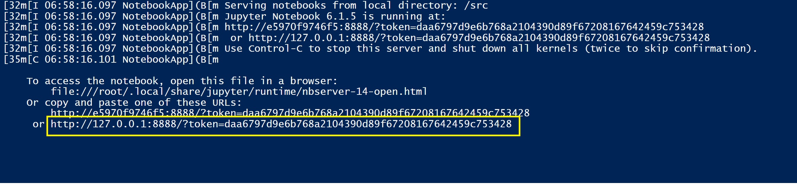

# EnsoPredict
## Description
put description here


## Run Project using Docker

This instruction below is showing how to run EnsoPredict using docker in local computer. For Windows machine, docker can be executed by having Docker Desktop installed and running. 


i. Make sure you have docker service installed and running in your local computer. For example in this project, Docker Desktop was already running in Windows machine. Open windows PowerShell and start typing below commands.


ii. Do git clone github repository by running: 

```
git clone https://github.com/ENSOPredict-Team2/EnsoPredictDist.git
```

Outside of powershell consoles, open file explorer and get into EnsoPredictDist\mount folder (according to each local machine path). Notice there are two folders inside it named "data" and "model" folder. This folder will hold the data and model files which can be downloaded from:

- Download files into "data" folder from: https://doi.org/10.6084/m9.figshare.13227473.v1 and http://portal.nersc.gov/project/dasrepo/AGU_ML_Tutorial/sst.mon.mean.trefadj.anom.1880to2018.nc

- Download files into "model" folder from: https://doi.org/10.6084/m9.figshare.13227608.v1 https://doi.org/10.6084/m9.figshare.13227599.v1 


iii. Back to powershell console, go into EnsoPredictDist folder:

```
cd EnsoPredictDist
```


iv. Build docker image using Dockerfile with prefered image name, in this case "ensodocker"

```
docker build . -t ensodocker
```


v. Check that image was successfully created, run:
 
```
docker images -a
``` 

See that image ensodocker is among the result.


vi. Run docker image in container by executing: (but need to change [path_to_mount_folder] with correct path first)

```
docker run --rm -it -d -p 8888:8888/tcp -v [path_to_mount_folder]:/src/mount ensodocker
```

for example if "mount" folder is located at 'D:\"DSCI 560"\EnsoPredictDist\mount' then the execution command will be:

```
docker run --rm -it -d -p 8888:8888/tcp -v D:\"DSCI 560"\EnsoPredictDist\mount:/src/mount ensodocker
```


vii. Check container name running ensodocker and see the name under NAMES header:

```
docker ps
```


viii. Execute the command below to run jupyter notebook for EnsoPredict: (but need to change [container_name] with correct name from step vii above)

```
docker exec -it [container_name] jupyter notebook --port=8888 --no-browser --ip=0.0.0.0 --allow-root
```

for example if container name is "nostalgic_nash" then the execution command will be:

```
docker exec -it nostalgic_nash jupyter notebook --port=8888 --no-browser --ip=0.0.0.0 --allow-root
```


ix. The powershell will show that jupyter notebook is running. Copy the link that being shown in the console and open in browser:




x. Open/click nino34index_ml_prediction.ipynb file, input parameters as instructed and run predictions.


xi. Quit jupyter notebook when finished by clicking Quit button at top right corner of jupyter tree browser.


xii. Stop container by running: (but need to change [container_name] with correct name from step vii above)

```
docker stop [container_name]
```

or using previous example container name then the command will be:

```
docker stop nostalgic_nash
```


xi. Input or output files can still be accessible inside local "mount" folder even after docker container has been stopped.


